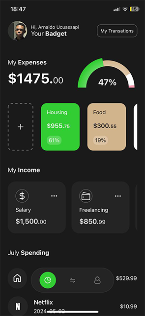
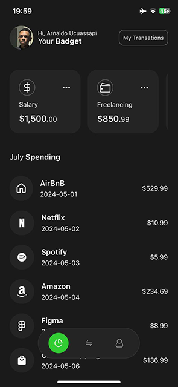

# Finance App

Este é um aplicativo de gerenciamento de finanças pessoais, projetado para ajudar os usuários a controlar seus gastos e orçamentos de forma eficiente. O aplicativo apresenta uma interface fácil de usar, com gráficos e visualizações para ajudar a compreender melhor as finanças.

### 📊 Características

* Visualização de gastos por categoria (Housing, Food, Saving, Miscellaneous)
* Gráfico de pizza para mostrar a distribuição dos gastos
* Listagem detalhada de cada gasto, incluindo o nome, valor e porcentagem do orçamento
* Possibilidade de adicionar novos gastos
* Visualização do total dos gastos e do orçamento

### 🛠️ Tecnologias Utilizadas

* React Native para o desenvolvimento do aplicativo
* Expo para a gestão de rotas e navegação
* React-native-gifted-charts para a criação de gráficos
* JSON para armazenamento de dados

### 📥 Instalação

Para instalar o aplicativo, siga os seguintes passos:

1. Clone o repositório do GitHub
2. Execute `npm install` ou `yarn install` para instalar as dependências
3. Execute `expo start` para iniciar o aplicativo

### 🤝 Contribuição

Se você deseja contribuir para o desenvolvimento do aplicativo, por favor, faça um fork do repositório e envie um pull request com suas alterações.
